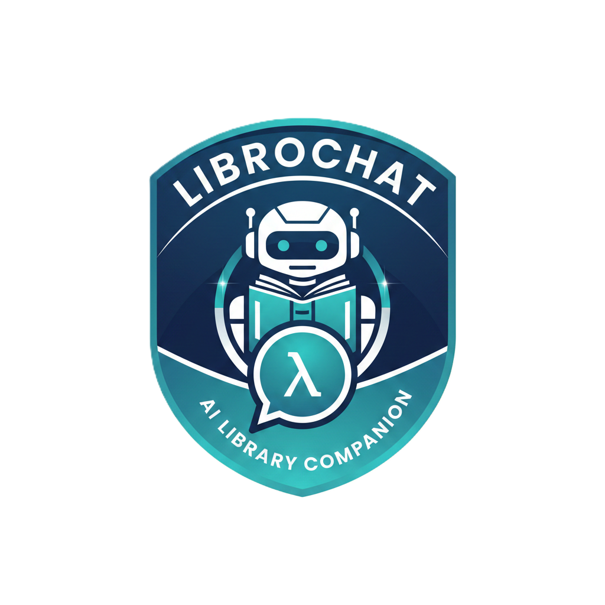

# AI Library Portal



## About The Project

AI Library Portal is a Retrieval-Augmented Generation (RAG) application that empowers users to interact with PDF documents through a seamless chat interface. Leveraging the power of Google Gemini for natural language processing and Pinecone for efficient vector search, the application allows users to upload documents and receive intelligent, context-aware answers to their queries.

### Key Features

*   **Intelligent Chat Interface**: Communicate with your documents using a responsive chat interface powered by Google Gemini.
*   **Streaming Responses**: Experience real-time responses with streaming support for a smoother conversation flow.
*   **PDF Ingestion**: Upload and process PDF documents to build a searchable knowledge base.
*   **Vector Search**: utilize Pinecone's vector database for fast and accurate information retrieval.
*   **Secure Authentication**: Protected routes and user management via Laravel Sanctum.
*   **Modern UI**: Built with React, Vite, and TailwindCSS for a polished and responsive user experience.

## Tech Stack

**Backend:**
*   [Laravel 10](https://laravel.com/)
*   [MySQL](https://www.mysql.com/)

**Frontend:**
*   [React](https://react.dev/)
*   [Vite](https://vitejs.dev/)
*   [TailwindCSS](https://tailwindcss.com/)

**AI & Machine Learning:**
*   [Google Gemini API](https://ai.google.dev/) (Embeddings & Chat)
*   [Pinecone](https://www.pinecone.io/) (Vector Database)

## Getting Started

Follow these steps to set up the project locally.

### Prerequisites

*   PHP 8.1 or higher
*   Composer
*   Node.js & npm
*   MySQL Database

### Installation

1.  **Clone the repository**
    ```bash
    git clone https://github.com/yourusername/chat-bot.git
    cd chat-bot
    ```

2.  **Install Backend Dependencies**
    ```bash
    composer install
    ```

3.  **Install Frontend Dependencies**
    ```bash
    npm install
    ```

4.  **Environment Configuration**
    Copy the example environment file and configure it.
    ```bash
    cp .env.example .env
    ```
    Update the `.env` file with your database, Gemini, and Pinecone credentials:
    ```env
    DB_DATABASE=your_database_name
    DB_USERNAME=your_database_user
    DB_PASSWORD=your_database_password

    GEMINI_API_KEY=your_gemini_api_key

    PINECONE_API_KEY=your_pinecone_api_key
    PINECONE_HOST=your_pinecone_host_url
    ```

5.  **Generate Application Key**
    ```bash
    php artisan key:generate
    ```

6.  **Run Migrations**
    Set up the database tables.
    ```bash
    php artisan migrate
    ```

7.  **Start the Development Servers**

    Start the Laravel backend:
    ```bash
    php artisan serve
    ```

    Start the Vite frontend dev server:
    ```bash
    npm run dev
    ```

## Usage

1.  Access the application at `http://localhost:8000` (or the URL provided by `php artisan serve`).
2.  Register or log in to your account.
3.  Navigate to the "Documents" section to upload PDF files.
4.  Once processed, go to the "Chat" section to start asking questions about your documents.

## Contributing

Contributions are welcome! Please feel free to submit a Pull Request.

## License

This project is open-sourced software licensed under the [MIT license](https://opensource.org/licenses/MIT).
